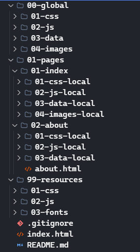

# **Project Structure**

This outlines a well-organized folder structure for managing websites. This approach promotes code reusability, simplifies maintenance, and enhances project clarity.

## **global**

* **css:** Contains global CSS stylesheets that apply to the entire website.
* **javascript:** Contains global JavaScript files that are used across multiple pages.
* **data:** Contains data files (e.g., JSON) for reusable components or modules.
* **images:** Stores images used across multiple pages or reusable components.

## **pages**

this makes it easy to maintain as every page has clear structure.

* **about:**
  * **css-local:** Contains CSS stylesheets specific to the contact about page.
  * **js-local:** Contains JavaScript files specific to the contact about page.
  * **data-local:** Contains localized data for the about page.
  * **about.html:** The main HTML file for the contact form page.

* **index**
  * **css-local:** Contains CSS stylesheets specific to the index page.
  * **js-local:** Contains JavaScript files specific to the index page.
  * **data-local:** Contains data files (e.g., JSON) for the index page.
  * **images-local:** Stores images used specifically on the index page.

## **resources**

* **css:** Contains CSS stylesheets for librarys or frameworks.
* **javascript:** Contains JavaScript files for librarys or frameworks.
* **fonts:** Stores custom fonts used throughout the project.

## **Additional Files**

* **.gitignore:** Specifies files and directories to be ignored by Git.
* **index.html:** The main HTML file for the project.
* **README.md:** This file! Provides an overview of the project sort of a documantation for the project.

## **Notes**

* The `global` directory is for assets that are used across the entire project.
* The `pages` directory is for assets specific to individual pages.
* The `resources` directory is for reusable components and modules.
* This structure promotes modularity and makes it easier to maintain and update the project.

By adopting this structure, you'll enhance your static website development experience and maintain a well-organized and manageable codebase.

## **for a project that needs even more organizing you can use numbers easily to keep everything in order**

**Core Folder Structure:**

**this way you can have even more organized folder structure and always keep everything in the same place**
